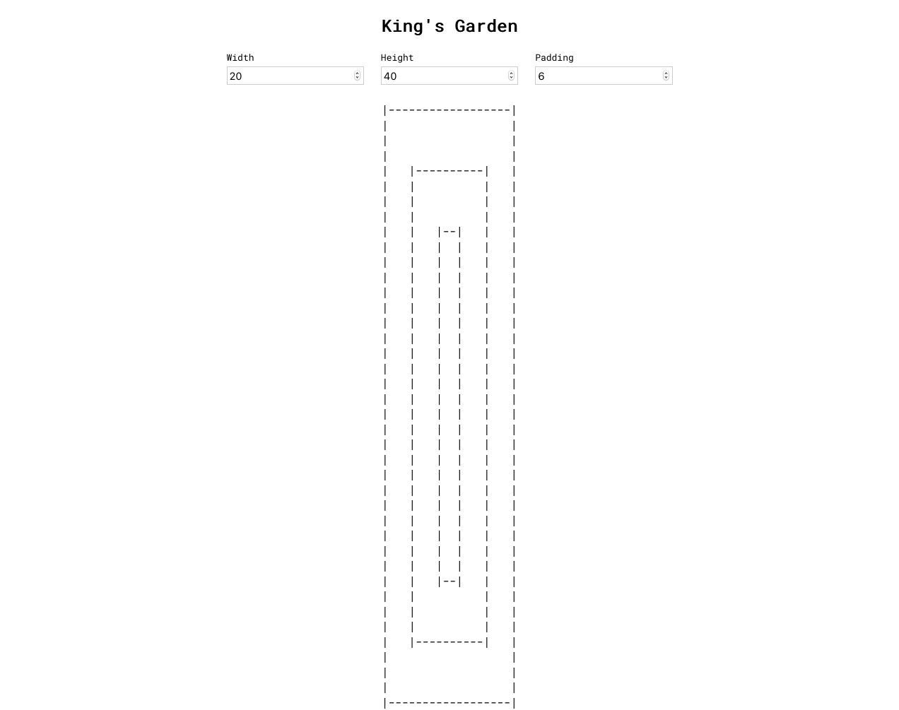
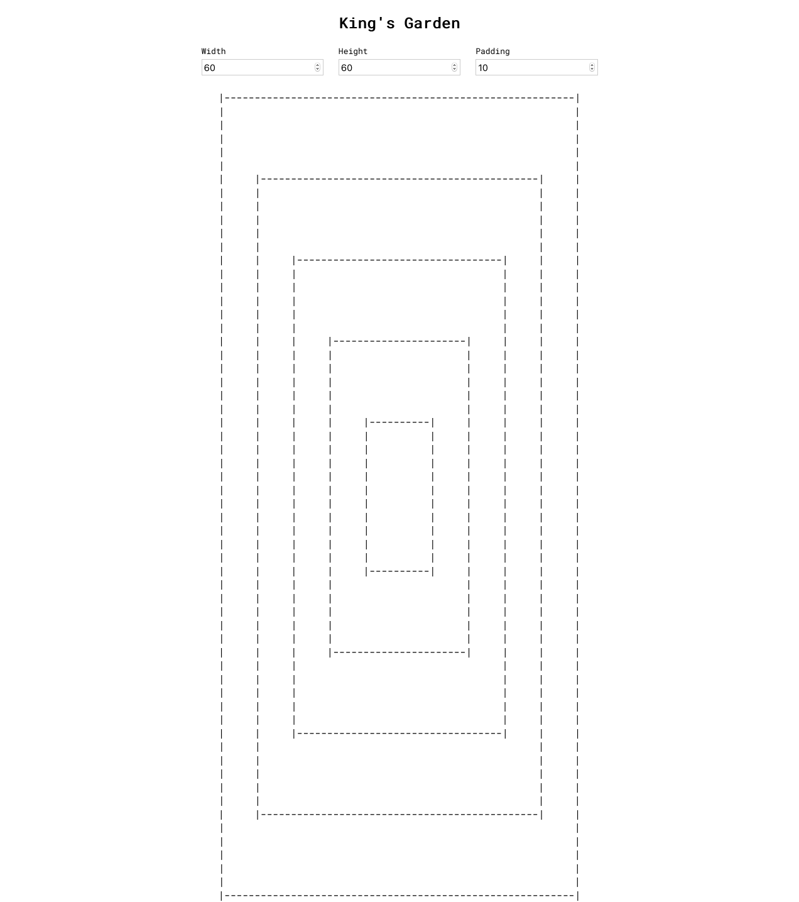
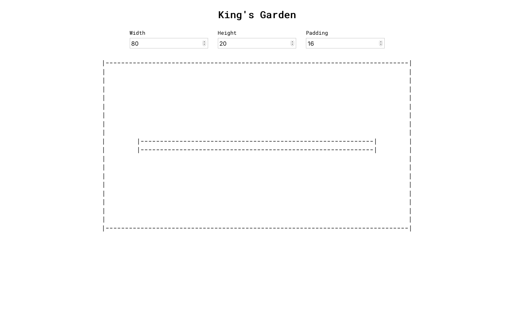
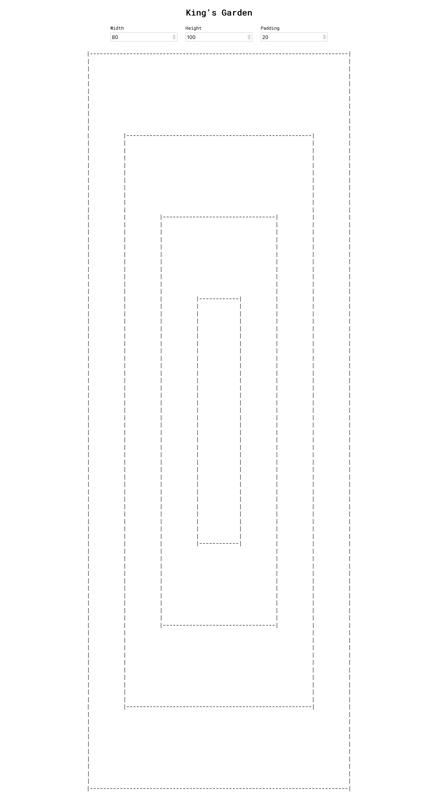

# King's Garden

## Available Scripts

In the project directory, you can run:

### `yarn start`

Runs the app in the development mode. 
Open [http://localhost:3000](http://localhost:3000) to view it in the browser.

### `yarn test`

Launches the test runner in the interactive watch mode. 

### `yarn build`

Builds the app for production to the `build` folder. 

## Big O
`O(n + g)`

## Screenshots

1. `(Width: 20, Height:40, padding: 6)`

2. `(Width: 60, Height:60, padding: 10)`

3. `(Width: 80, Height:20, padding: 16)`

4. `(Width: 80, Height:100, padding: 20)`

